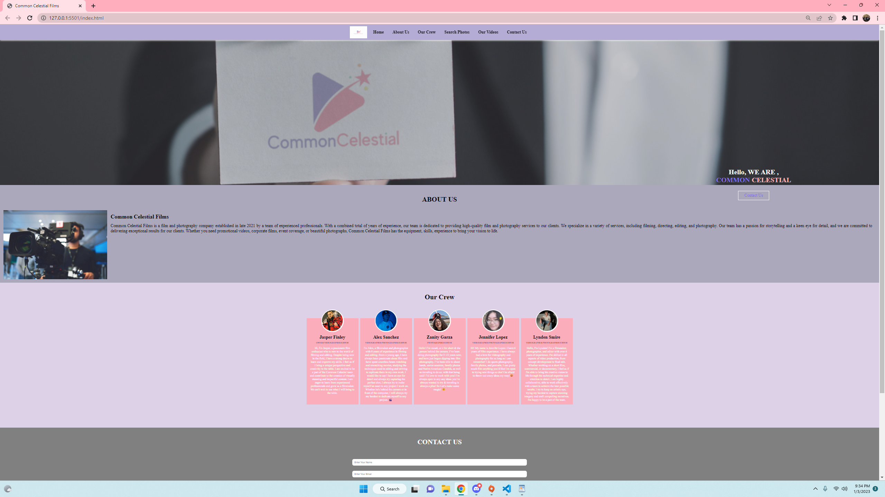

# Common-Celestial-films
## Description

Provide a short description explaining the what, why, and how of your project. Use the following questions as a guide:

- Our motivation for this project was to challange ourselfs as a group.
- We built this website for a small buisness that is starting up.
- This website solves the issue of networking someone can simply click on the URL to the website and all of the information is here at there fingertips 
- We learned allot about java and API'S in this project we also learned how to work together as devs 

## Table of Contents (Optional)

If your README is long, add a table of contents to make it easy for users to find what they need.

- [Installation](#installation)
- [Usage](#usage)
- [Credits](#credits)
- [License](#license)

## Installation

We dont need any kind of installation just use the URL and learn all about Common Celestial Films

## Usage

Provide instructions and examples for use. Include screenshots as needed.

## Credits
- https://github.com/Ash0422
- https://github.com/activator95
- https://github.com/TacoCodes
- https://github.com/Savonyp
- https://github.com/eskevin14th

- We Used youtube API from youtube 
- We used photo finder API from Pexels

- https://ionic.io/ionicons/usage#search-outline       
- https://imagecolorpicker.com/      
- https://www.pexels.com/api/documentation/#photos-search        
- https://developers.google.com/youtube/v3            
- https://www.youtube.com/watch?v=EAyo3_zJj5c         
- https://console.cloud.google.com/

## License
- N/A
## Badges

## Features

- Photo searching API
- API that shows Common Celestial films 
- About us
- Contact us
- Our crew

## Our crew
- the boys